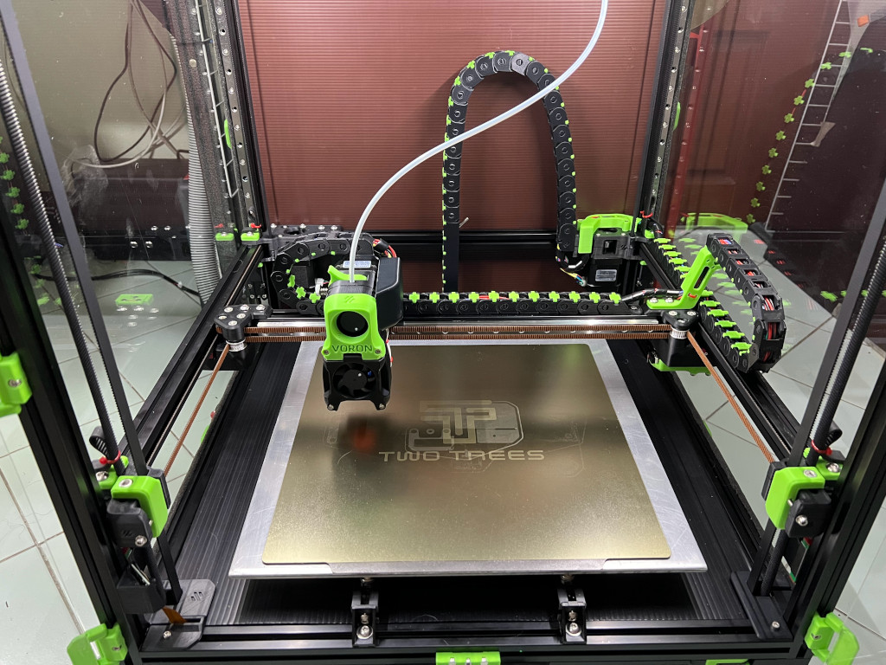
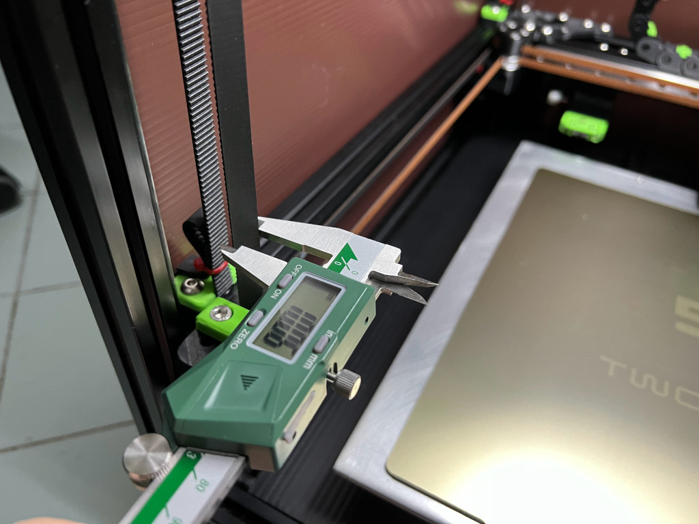

<b>10mm GT2 Z-Belts Mod (Voron v2.4r2)</b>

During an attempt to self-source a Voron v2.4r2. I've found that the local seller only sell 6mm and 10mm GT2 belt and pulley while the BOM specified a 9mm Z-belt and pulley. So I decieded to go with 10mm belt and pulley only to found out that the pathway through the A and B motor mount was too narrow for a 10mm belt. 

But surprisingly, All the pulley and idler related parts are fine. So I've edit the STL file in blender by slightly enlarged the belt pathway and the gripping notch.

My Voron v2.4r2 is now working but is still in process of making so USE AT YOUR OWN RISK.

<b>FAQ</b> 
- <b>No CAD files?</b> 
There is no CAD file on this mod since I don't have a Fusion so I didn't work on the CAD files. I just use a blender to manipulate the STL files.
- <b>Do I need this?</b> 
Not if you can source a 9mm GT2 belt, But accually, If you already printed the original version you could try to use a hot air to soften the parts and nudge the plastic so the slot are wider but the resulting finish may not be very good.(Don't ask me how I know it.)
- <b>BOM?</b> 
Just replace all the 9mm GT2 Belt, Pulley, Idler with 10mm parts.
