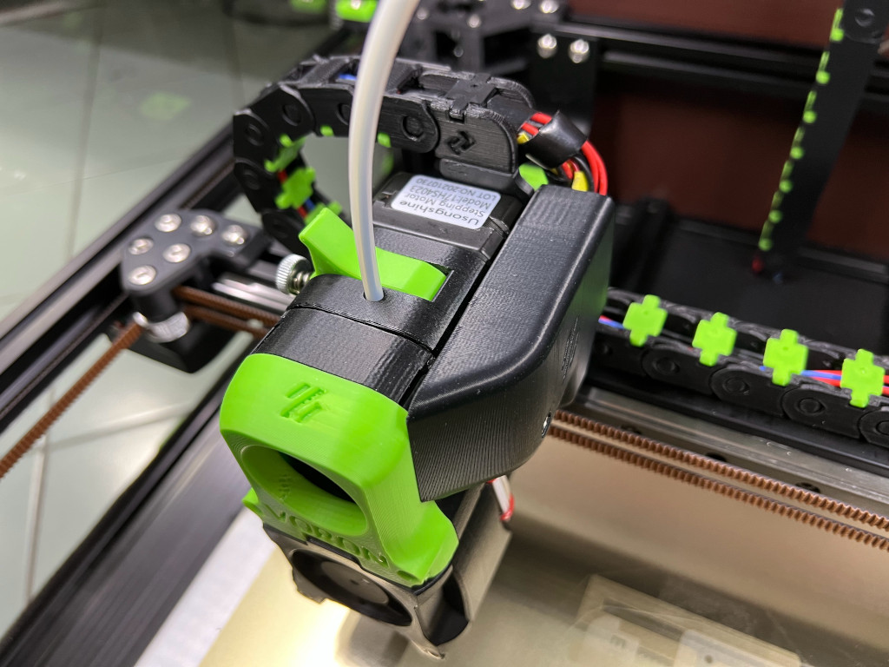

<b>ERCF AB Cover for 23mm motor</b> 
    This is a my modified version of: 
    
    https://github.com/VoronDesign/Voron-Hardware/blob/master/Afterburner_Toolhead_PCB/STLs/Clockwork/Covers/ERCF_pcb_cover_stock_afterburner.stl
    
     Modified to fit a 23mm long NEMA17 17HS4023 motor <b>without a PCB</b>, if you're using a ERCF PCB then please use a spacer rod from the original file (or just trim off as needed).

     Note: In order to use a 17HS4023 motor in Afterburner you need to cut or grind the motor shaft 2 mm. Also the motor back is 3 mm longer and may cause some chain to not align perfectly. (I use PanzerChain)
