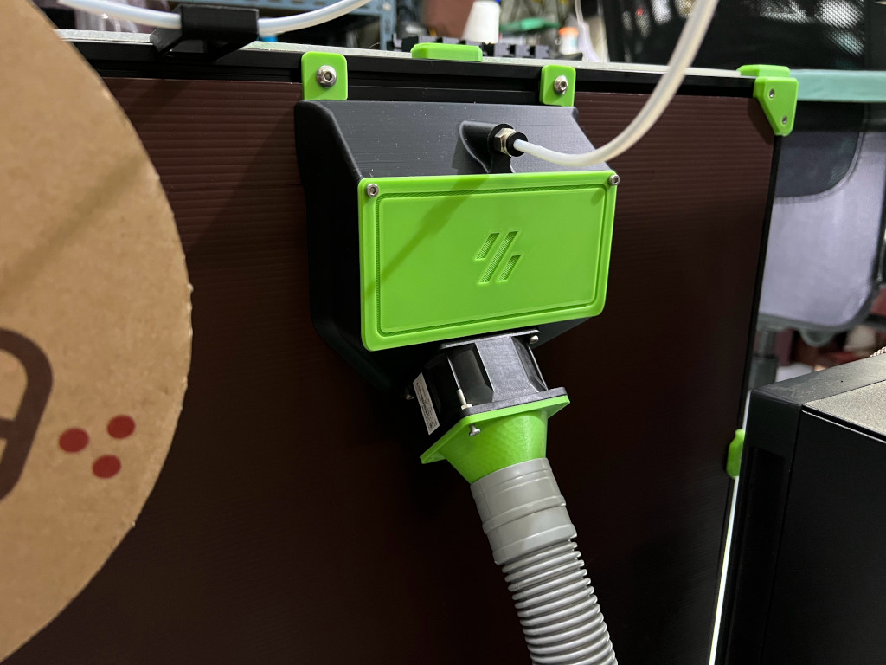
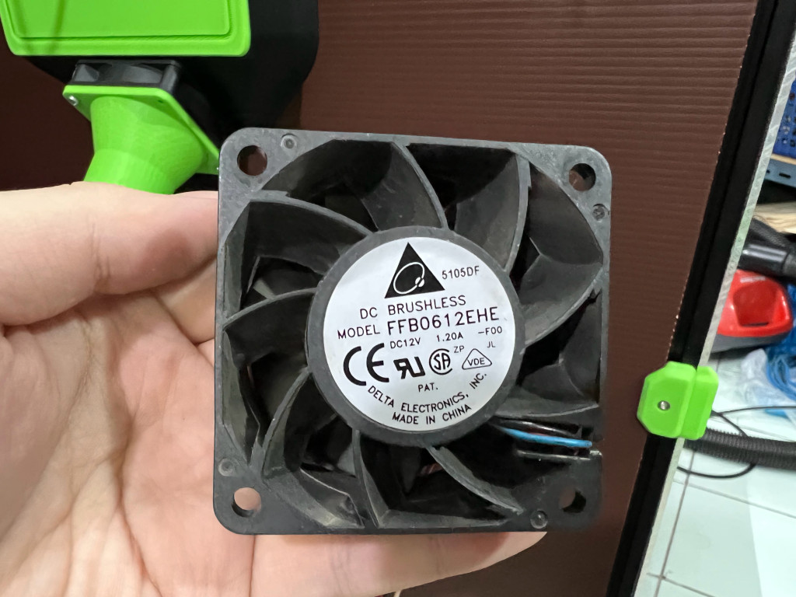

# Exhaust Fan Duct for Voron2.4r2
This is my designed 60mm fan duct adapter for using a washing machine drain tube as a exhaust duct, The OD of connecting mount is 37.5 mm.

Please noted that the washing machine tube is small diameter and has a high resistant which mean either you use a very short tube (less than 1 meter) or you will need a powerful server fan (high static pressure) to push a pratical amount of air through.

    
I use 3 meter tube with a Delta 12v 1.2A ex-server fan (see photo) run directly off the BTT Octopus v1.1 board.
    Also included a FreeCAD file so you can modify it to fit.
