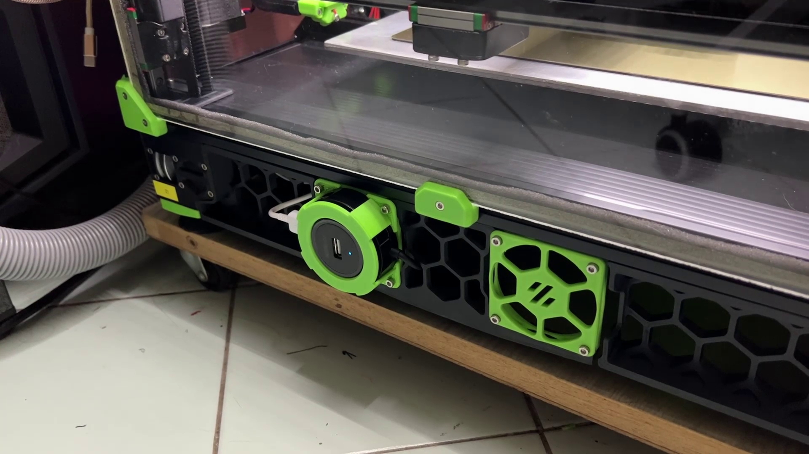
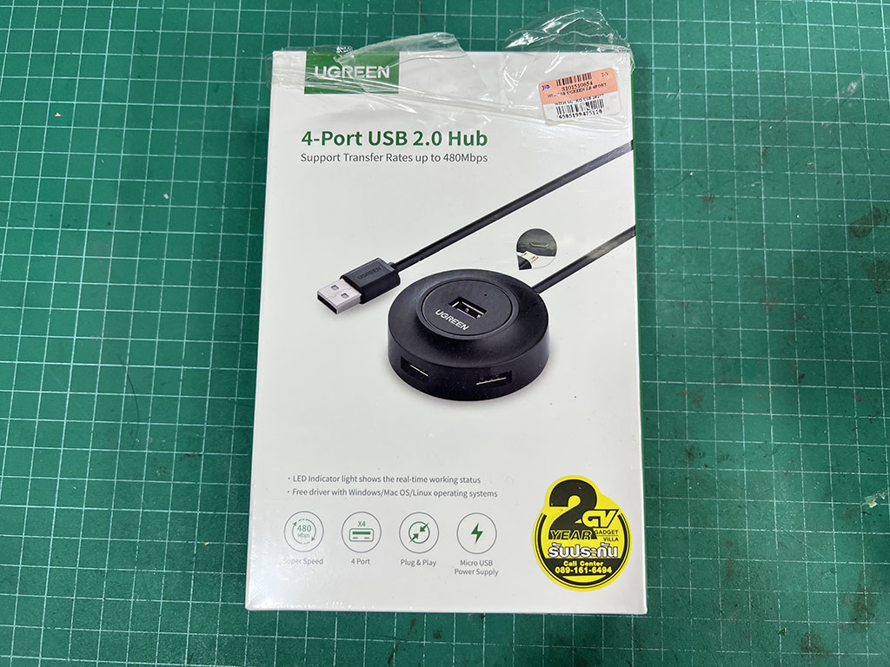

# USB Hub mount for Voron2.4r2
This is my designed for mounting a UGreen USB 2.0 hub to the unused fan slot on Voron v2.4r2.

# Why using a USB Hub?
Because I'm using a Raspberry Pi 2w which has only 1 USB port and want to connect the Octopus board, an Enranged Rabbit Carrot Feeder module and an USB accerometer.

This is a USB hub I'm using, I also include a FreeCAD files so you can modify to suit your need.

Note: Current design is blocking a microUSB power input port on the hub, Some modification is need if you want to use the power in port.
